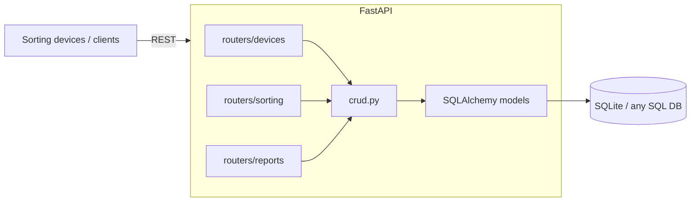

# Smart Waste Sorting Tracker

A **FastAPI** backend for municipalities and recycling companies to manage smart waste-sorting devices: register devices with their locations, log every sorting operation (waste type + weight), and generate aggregate reports of collected quantities per waste type.


---

## Architecture



Clean layered design: **routers** (HTTP) → **schemas** (Pydantic validation) → **crud** (business logic) → **models** (SQLAlchemy ORM).

## API Overview

| Area | Endpoints | Purpose |
|---|---|---|
| Devices | `POST /devices`, `GET /devices` | Register & list sorting devices with location |
| Sorting | `POST /sorting`, `GET /sorting` | Log operations (device, waste type, weight) |
| Reports | `GET /reports/summary` | Total collected weight grouped by waste type |

Interactive documentation is auto-generated at **`/docs`** (Swagger UI) and **`/redoc`**.

## Getting Started

```bash
# 1. Environment (conda or venv)
conda create -n smart_tracker python=3.10 && conda activate smart_tracker

# 2. Dependencies
pip install -r requirements.txt

# 3. Run
uvicorn app.main:app --reload
```

Open `http://127.0.0.1:8000/docs` and try the API from the browser.

## Project Structure

```
app/
├── main.py        # App factory, router registration
├── database.py    # Engine & session management
├── models.py      # SQLAlchemy ORM models (Device, SortingOperation)
├── schemas.py     # Pydantic request/response schemas
├── crud.py        # Data-access layer
└── routers/
    ├── devices.py
    ├── sorting.py
    └── reports.py
```

## Tech Stack

FastAPI · Pydantic · SQLAlchemy · SQLite (swap for PostgreSQL/MySQL via `DATABASE_URL`) · Uvicorn

## Roadmap

- [ ] Device authentication (API keys)
- [ ] Time-range filters & CSV export for reports
- [ ] Dockerfile + compose for one-command deployment
